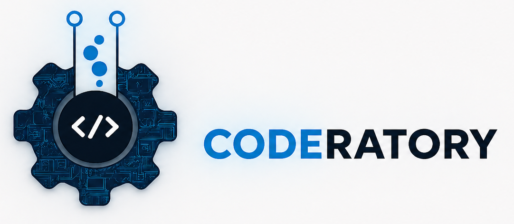

# 
## Welcome

Innovating at the Intersection of Scalability and Precision
At Coderatory, we believe that software should do more than just function—it should elevate user experiences, streamline complex workflows, and push the boundaries of technical possibility. We are a software organization dedicated to engineering robust, high-performance solutions tailored to the evolving demands of the modern digital landscape.

### Our Core Domains
We specialize in high-impact software ecosystems, ranging from user-centric SaaS platforms to deep-tech research applications:

- SaaS Ecosystems: Delivering high-availability solutions for Sports & Gaming, Education (LMS), and end-to-end Enterprise Resource Planning (ERP).
- Deep Tech & Research: Pushing technical frontiers in 3D navigation engines and high-throughput media streaming architectures.
- Performance-First: We prioritize clean, maintainable, and optimized code that is built to scale in production environments.

### Get in Touch
We are always looking for new challenges and collaborative opportunities.

- Website: YourWebsiteURL.com
- Email: contact@coderatory.com
- LinkedIn: linkedin.com/company/coderatory
